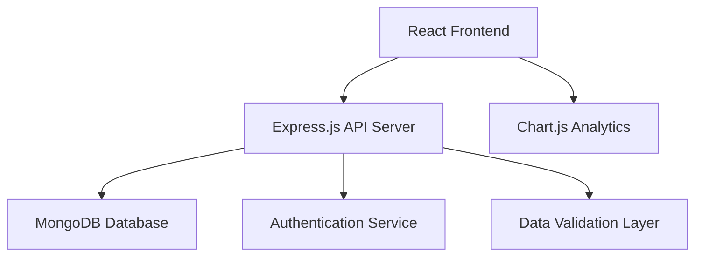

# Design Document: ONC REALTY PARTNERS Booking System

## Overview

The ONC REALTY PARTNERS booking system is a modern web application built to manage real estate bookings with role-based authentication, comprehensive record management, and analytical reporting capabilities. The system follows a three-tier architecture with a React frontend, Node.js/Express backend, and MongoDB database for scalable data management.

## Architecture

The system employs a client-server architecture with the following key components:



### Technology Stack
- **Frontend**: React with TypeScript for type safety and component-based UI
- **Backend**: Node.js with Express.js for RESTful API services
- **Database**: MongoDB for flexible document storage of booking records
- **Authentication**: JWT-based session management
- **Analytics**: Chart.js for interactive data visualizations
- **Styling**: CSS modules for component-scoped styling

## Components and Interfaces

### Authentication Component
- **LoginForm**: Handles user credential input and validation
- **AuthService**: Manages JWT token generation, validation, and session state
- **RoleGuard**: Implements role-based access control for routes and features

### Booking Management Component
- **BookingTable**: Displays booking records in sortable, filterable table format
- **BookingForm**: Handles creation and editing of booking records with validation
- **BookingService**: API interface for CRUD operations on booking data
- **SearchFilter**: Provides advanced filtering and search capabilities

### Analytics Dashboard Component
- **DashboardContainer**: Main analytics interface with multiple chart views
- **ChartComponents**: Individual chart types (line, bar, pie) for different metrics
- **DataProcessor**: Transforms raw booking data for chart consumption
- **ExportService**: Handles report generation and download functionality

## Data Models

### User Model
```typescript
interface User {
  id: string;
  username: string;
  password: string; // hashed
  role: 'admin' | 'sales_person';
  createdAt: Date;
  lastLogin: Date;
}
```

### Booking Model
```typescript
interface Booking {
  id: string;
  customerName: string;
  projectName: string;
  contactNumber: string;
  type: string; // 2BHK, 3BHK, etc.
  area: number;
  agreementCost: number;
  amount: number;
  taxGST: number;
  refundBuyer: number;
  refundReferral: number;
  oncTrustFund: number;
  oncctFunded: number;
  invoiceStatus: string;
  timeline: Date;
  loanReq: string;
  status: 'active' | 'complete' | 'cancelled';
  createdAt: Date;
  updatedAt: Date;
  createdBy: string; // user ID
}
```

### Analytics Data Model
```typescript
interface AnalyticsData {
  totalBookings: number;
  totalRevenue: number;
  completionRate: number;
  monthlyTrends: MonthlyData[];
  projectDistribution: ProjectData[];
  revenueByType: TypeRevenue[];
}
```

## Correctness Properties

*A property is a characteristic or behavior that should hold true across all valid executions of a system-essentially, a formal statement about what the system should do. Properties serve as the bridge between human-readable specifications and machine-verifiable correctness guarantees.*

After analyzing the acceptance criteria, I've identified several key properties that can be combined for comprehensive testing:

### Property 1: Authentication Access Control
*For any* valid user credentials, authentication should grant access to features appropriate to the user's role, with admins receiving full access and sales persons receiving restricted access
**Validates: Requirements 1.1, 1.4, 1.5**

### Property 2: Authentication Rejection
*For any* invalid credentials (wrong password, non-existent user, malformed input), the authentication system should reject the login attempt and return an appropriate error message
**Validates: Requirements 1.2**

### Property 3: Session Persistence
*For any* authenticated user session, the session should remain valid throughout normal user interactions and expire only when appropriate security conditions are met
**Validates: Requirements 1.6**

### Property 4: Booking Data Completeness
*For any* booking creation or edit operation, all required fields should be validated and captured correctly, with proper audit trail maintenance
**Validates: Requirements 2.1, 2.3**

### Property 5: Booking Display and Search
*For any* set of booking records, the display system should show all records in sortable format and search functionality should return correct results across all fields
**Validates: Requirements 2.2, 2.5**

### Property 6: Data Integrity Operations
*For any* booking deletion operation, the system should require confirmation and maintain data integrity without corrupting other records
**Validates: Requirements 2.4**

### Property 7: Calculation Accuracy
*For any* booking record with financial data, derived calculations (totals, taxes, etc.) should be mathematically correct
**Validates: Requirements 2.6**

### Property 8: Data Persistence Round Trip
*For any* booking data that is saved, retrieving the data should return exactly the same information that was stored
**Validates: Requirements 2.7**

### Property 9: Analytics Chart Generation
*For any* valid booking dataset, the analytics dashboard should generate all required chart types (trends, distribution, revenue) with accurate data representation
**Validates: Requirements 3.1, 3.2**

### Property 10: Dynamic Filtering
*For any* analytics filter criteria applied to booking data, the resulting charts should update to reflect only the filtered subset of data
**Validates: Requirements 3.3**

### Property 11: KPI Calculation
*For any* booking dataset, key performance indicators (total bookings, revenue, completion rates) should be calculated correctly from the underlying data
**Validates: Requirements 3.4**

### Property 12: Export Data Integrity
*For any* analytics export operation, the exported data should contain the same information displayed in the charts and be in the requested format
**Validates: Requirements 3.5**

## Error Handling

The system implements comprehensive error handling across all layers:

### Authentication Errors
- Invalid credentials return structured error responses with appropriate HTTP status codes
- Session expiration triggers automatic logout with user notification
- Rate limiting prevents brute force attacks with temporary account lockout

### Data Validation Errors
- Client-side validation provides immediate feedback for form inputs
- Server-side validation ensures data integrity with detailed error messages
- Database constraint violations are caught and translated to user-friendly messages

### System Errors
- Database connection failures trigger retry mechanisms with fallback responses
- API timeouts are handled gracefully with user notification
- Unexpected errors are logged for debugging while showing generic user messages

### Analytics Errors
- Missing or insufficient data for charts displays appropriate empty state messages
- Chart rendering failures fall back to tabular data display
- Export failures provide retry options and error explanations

## Testing Strategy

The system employs a dual testing approach combining unit tests and property-based tests for comprehensive coverage:

### Unit Testing
- **Authentication**: Test specific login scenarios, demo credentials, and session management
- **Booking CRUD**: Test individual create, read, update, delete operations with known data
- **Analytics**: Test chart generation with specific datasets and edge cases
- **Error Conditions**: Test specific error scenarios and boundary conditions

### Property-Based Testing
- **Framework**: Use fast-check for JavaScript/TypeScript property-based testing
- **Configuration**: Minimum 100 iterations per property test for thorough randomization
- **Coverage**: Each correctness property implemented as a separate property-based test
- **Tagging**: Each test tagged with format: **Feature: realty-booking-system, Property N: [property description]**

### Integration Testing
- End-to-end user workflows from login through booking management to analytics
- API integration tests ensuring frontend-backend communication
- Database integration tests verifying data persistence and retrieval

### Test Organization
- Unit tests focus on specific examples, edge cases, and error conditions
- Property tests verify universal properties across all possible inputs
- Both approaches are complementary and necessary for complete validation
- Tests are co-located with source files using `.test.ts` suffix for maintainability